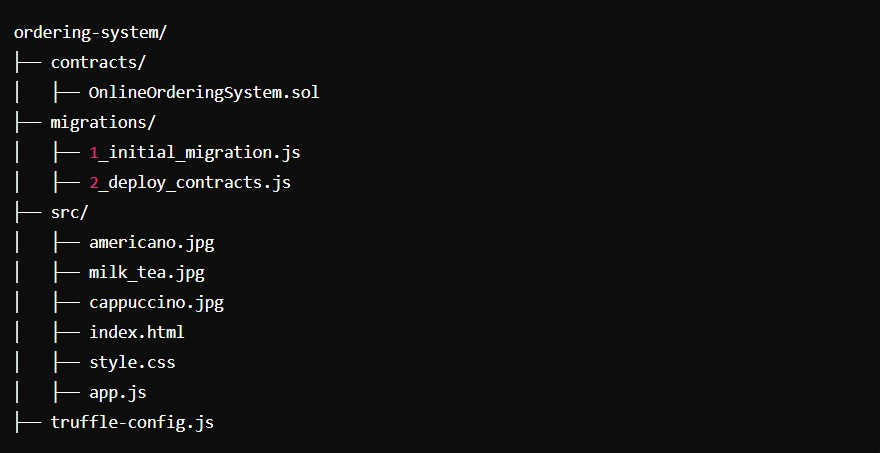

# order-system-based-on-smart-comtract
Link to demo video in youtube:[Demo Video](https://youtu.be/fxUdtGyFeIo)

use smart contract concept to implement an ordering sysstem.

Your files' structer will be similar like that.

# Step-by-Step Guide(Install & Compile):
Install Prerequisites:

Node.js: Download and install from nodejs.org

Truffle: Install Truffle globally using npm

Ganache: Download and install Ganache from trufflesuite.com/ganache

Web3js: install 

Express

### 1.在命令行中執行以下指令, use these cmd code to install necessary packages：
```bash
npm install -g truffle
mkdir online-ordering-system
cd online-ordering-system
npm install express
npm uninstall web3
truffle init
```
### 2.Create Smart Contract: In your project directory, navigate to the contracts folder and create or use a file named OnlineOrderingSystem.sol.
### 3.Create Migration Script: In the migrations folder, create a new file named 2_deploy_contracts.js.
### 4.Configure Truffle: Edit truffle-config.js to configure the development network.
### 5.Start Ganache: Open Ganache and start a new workspace. Ensure it's running on 127.0.0.1:7545'.Of course you can change the localhost by yourself.
### 6.Compile and Deploy the Contract:
```bash
truffle compile
truffle migrate --network development
```
# Step-by-Step Guide(Test):
### 1.(Testing) Install Mocha and Chai: Truffle uses Mocha and Chai for testing by default. They should already be included, but ensure they're installed.
```bash
npm install mocha chai
```
### 2.Create Test File: In the test folder, create a new file named onlineOrderingSystem.test.js.Then run Tests:
```bash
truffle test
```
# Step-by-Step Guide(Using Truffle CLI to Interact with the Contract):
### 1.Start Ganache:Make sure Ganache is running and configured properly.
### 2.Deploy the Contract and Open Truffle Console::
```bash
truffle migrate --reset
truffle console
```
### 3.Interact with the Contract:
```bash
// Get the deployed contract instance
let instance = await OnlineOrderingSystem.deployed();

// Get accounts
let accounts = await web3.eth.getAccounts();

// Place an order
await instance.placeOrder(1, 1, 1, { value: 60, from: accounts[0] });

// Get order details
let order = await instance.getOrder(accounts[0]);
console.log(order);

// Check contract balance
let balance = await web3.eth.getBalance(instance.address);
console.log("Contract Balance:", web3.utils.fromWei(balance, "ether"), "ETH");

// Withdraw funds
await instance.withdrawFunds({ from: accounts[0] });

// Check contract balance after withdrawal
balance = await web3.eth.getBalance(instance.address);
console.log("Contract Balance after withdrawal:", web3.utils.fromWei(balance, "ether"), "ETH");
```
# Step-by-Step Guide(UI & API Part):
### 1. Setup HTML (src/index.html) & Style the Page (src/style.css) & Implement JavaScript (src/app.js).Remenber to replace your contract address and abi in app.js.
Explanation:

HTML:

Displays the customer address and account balance.

Shows images of Americano, Milk Tea, and Cappuccino with input fields for quantity.

Includes buttons to confirm the order and to pay for it.

CSS:

Styles the page to make it visually appealing and user-friendly.

JavaScript:

Uses Web3.js to interact with the Ethereum blockchain.

Loads the customer's account and balance.

Confirms the order by calculating the total cost and displaying the order summary.

Processes the payment by interacting with the smart contract.

### 2.Running the Web Page: Various ways to see your web via vscode extension like : live server( this project used)
